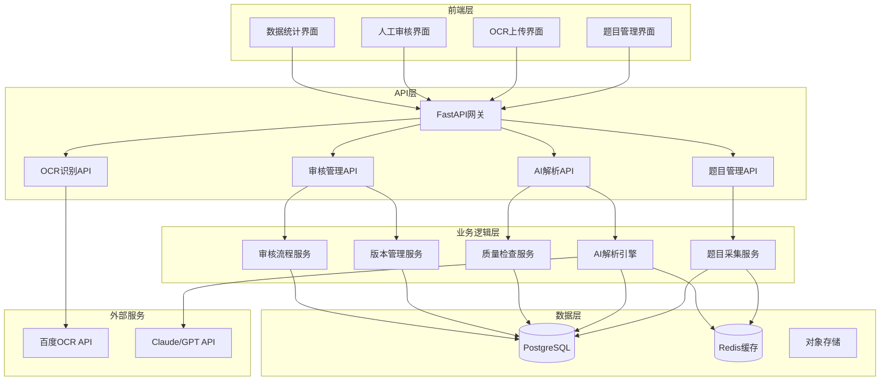
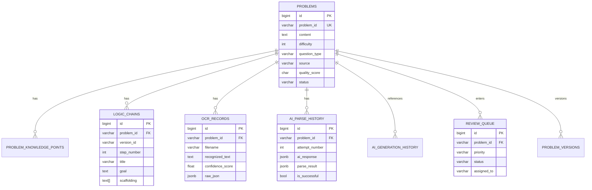

# 题库管理系统技术架构设计

> **相关文档**: [业务需求文档](../requirements/02-question-bank.md)

## 概述

本文档详细描述题库管理系统的技术架构设计，包括数据库设计、API接口设计、核心模块技术实现等。


## 1. 系统架构

### 1.1 整体架构



### 1.2 核心模块划分

| 模块 | 技术实现 | 说明 |
|-----|---------|------|
| **OCR识别模块** | Python + 百度OCR API | 图像识别转文本 |
| **AI生成相似题模块** | Python + Claude API | 基于案例生成变体题目 |
| **AI解析引擎** | Python + Claude API | 题目逻辑链自动分解 |
| **质量检查服务** | Python + 规则引擎 | 多维度质量评估 |
| **人工审核系统** | React + FastAPI | 审核队列和工具 |
| **版本管理系统** | PostgreSQL | 版本记录和对比 |

---

## 2. 数据库设计

### 2.1 核心数据表

#### 2.1.1 题目表 (problems)

```sql
CREATE TABLE problems (
    id BIGSERIAL PRIMARY KEY,
    problem_id VARCHAR(50) UNIQUE NOT NULL,  -- P_MATH_2024_025
    content TEXT NOT NULL,                    -- 题目内容
    difficulty INTEGER CHECK (difficulty BETWEEN 1 AND 5),
    question_type VARCHAR(20) NOT NULL,       -- 选择/填空/计算/应用/证明
    source VARCHAR(50) NOT NULL,              -- OCR识别/AI生成/在线爬取/人工录入
    source_detail TEXT,                       -- 来源详情
    tags TEXT[],                              -- 标签数组
    quality_score CHAR(1) CHECK (quality_score IN ('A', 'B', 'C', 'D')),
    status VARCHAR(20) DEFAULT 'pending',     -- pending/reviewing/approved/archived
    created_at TIMESTAMP DEFAULT NOW(),
    updated_at TIMESTAMP DEFAULT NOW()
);

CREATE INDEX idx_problems_problem_id ON problems(problem_id);
CREATE INDEX idx_problems_difficulty ON problems(difficulty);
CREATE INDEX idx_problems_type ON problems(question_type);
CREATE INDEX idx_problems_status ON problems(status);
CREATE INDEX idx_problems_quality ON problems(quality_score);
```

#### 2.1.2 题目-知识点关联表 (problem_knowledge_points)

```sql
CREATE TABLE problem_knowledge_points (
    id BIGSERIAL PRIMARY KEY,
    problem_id VARCHAR(50) NOT NULL,
    kp_id VARCHAR(20) NOT NULL,               -- KP02_1
    created_at TIMESTAMP DEFAULT NOW(),
    FOREIGN KEY (problem_id) REFERENCES problems(problem_id) ON DELETE CASCADE
);

CREATE INDEX idx_pkp_problem ON problem_knowledge_points(problem_id);
CREATE INDEX idx_pkp_kp ON problem_knowledge_points(kp_id);
```

#### 2.1.3 逻辑链表 (logic_chains)

```sql
CREATE TABLE logic_chains (
    id BIGSERIAL PRIMARY KEY,
    problem_id VARCHAR(50) NOT NULL,
    version_id VARCHAR(20) NOT NULL,          -- v1.0, v1.1, v2.0
    step_number INTEGER NOT NULL,
    title VARCHAR(100) NOT NULL,              -- 步骤标题
    target_kp VARCHAR(100) NOT NULL,          -- KP02_1 (路程与坐标互化)
    goal TEXT NOT NULL,                       -- 本步骤目标
    check_points TEXT[],                      -- 检查点数组
    scaffolding TEXT[] NOT NULL,              -- 三级提示数组
    created_by VARCHAR(50),                   -- AI或人工
    created_at TIMESTAMP DEFAULT NOW(),
    FOREIGN KEY (problem_id) REFERENCES problems(problem_id) ON DELETE CASCADE,
    UNIQUE(problem_id, version_id, step_number)
);

CREATE INDEX idx_lc_problem ON logic_chains(problem_id);
CREATE INDEX idx_lc_version ON logic_chains(version_id);
```

#### 2.1.4 OCR识别记录表 (ocr_records)

```sql
CREATE TABLE ocr_records (
    id BIGSERIAL PRIMARY KEY,
    problem_id VARCHAR(50),                    -- 关联的题目ID（可为空，识别后生成）
    filename VARCHAR(255) NOT NULL,
    file_path VARCHAR(500),
    recognized_text TEXT,
    confidence_score FLOAT CHECK (confidence_score BETWEEN 0 AND 1),
    words_count INTEGER,
    raw_json JSONB,                           -- 原始API返回数据
    status VARCHAR(20) DEFAULT 'success',     -- success/failed/pending
    error_message TEXT,
    created_at TIMESTAMP DEFAULT NOW()
);

CREATE INDEX idx_ocr_problem ON ocr_records(problem_id);
CREATE INDEX idx_ocr_confidence ON ocr_records(confidence_score);
CREATE INDEX idx_ocr_status ON ocr_records(status);
```

#### 2.1.5 AI解析历史表 (ai_parse_history)

```sql
CREATE TABLE ai_parse_history (
    id BIGSERIAL PRIMARY KEY,
    problem_id VARCHAR(50) NOT NULL,
    attempt_number INTEGER NOT NULL,          -- 第1次、第2次、第3次、第4次
    prompt_template TEXT,                     -- 使用的提示词模板
    prompt_context JSONB,                     -- 注入的上下文（知识库、示例等）
    ai_response JSONB,                        -- AI返回的原始数据
    parse_result JSONB,                       -- 解析后的逻辑链
    error_type VARCHAR(50),                   -- 格式错误/质量不达标/数学不合理
    error_message TEXT,
    duration_ms INTEGER,                      -- 耗时（毫秒）
    is_successful BOOLEAN,
    quality_score CHAR(1),                    -- A/B/C/D
    created_at TIMESTAMP DEFAULT NOW(),
    FOREIGN KEY (problem_id) REFERENCES problems(problem_id) ON DELETE CASCADE
);

CREATE INDEX idx_aph_problem ON ai_parse_history(problem_id);
CREATE INDEX idx_aph_attempt ON ai_parse_history(attempt_number);
CREATE INDEX idx_aph_success ON ai_parse_history(is_successful);
```

#### 2.1.6 AI生成相似题记录表 (ai_generation_history)

```sql
CREATE TABLE ai_generation_history (
    id BIGSERIAL PRIMARY KEY,
    reference_problem_id VARCHAR(50) NOT NULL,  -- 参考题目ID
    generated_problem_id VARCHAR(50),            -- 生成的题目ID
    variation_strategy VARCHAR(50),              -- 综合变体
    target_difficulty INTEGER,
    target_kps TEXT[],                           -- 目标知识点
    generation_prompt JSONB,
    ai_response JSONB,
    quality_check_result JSONB,                  -- 知识点验证、数学合理性、可解题性
    quality_score CHAR(1),
    status VARCHAR(20) DEFAULT 'pending',        -- pending/approved/rejected
    attempt_number INTEGER DEFAULT 1,
    error_message TEXT,
    created_at TIMESTAMP DEFAULT NOW(),
    FOREIGN KEY (reference_problem_id) REFERENCES problems(problem_id)
);

CREATE INDEX idx_agh_reference ON ai_generation_history(reference_problem_id);
CREATE INDEX idx_agh_generated ON ai_generation_history(generated_problem_id);
CREATE INDEX idx_agh_status ON ai_generation_history(status);
```

#### 2.1.7 待审核队列表 (review_queue)

```sql
CREATE TABLE review_queue (
    id BIGSERIAL PRIMARY KEY,
    problem_id VARCHAR(50) NOT NULL,
    source_type VARCHAR(50) NOT NULL,           -- AI解析失败/AI生成质量C级/人工抽检/用户反馈
    priority VARCHAR(10) NOT NULL,              -- P0/P1/P2/P3
    reason TEXT,                                -- 加入队列的原因
    assigned_to VARCHAR(50),                    -- 分配给的审核人员ID
    status VARCHAR(20) DEFAULT 'pending',       -- pending/in_progress/completed
    attempt_count INTEGER DEFAULT 0,
    error_details JSONB,                        -- 失败原因详情
    due_date TIMESTAMP,                         -- 处理时限
    created_at TIMESTAMP DEFAULT NOW(),
    assigned_at TIMESTAMP,
    completed_at TIMESTAMP,
    FOREIGN KEY (problem_id) REFERENCES problems(problem_id) ON DELETE CASCADE
);

CREATE INDEX idx_rq_problem ON review_queue(problem_id);
CREATE INDEX idx_rq_priority ON review_queue(priority);
CREATE INDEX idx_rq_status ON review_queue(status);
CREATE INDEX idx_rq_assigned ON review_queue(assigned_to);
CREATE INDEX idx_rq_due ON review_queue(due_date);
```

#### 2.1.8 题目版本历史表 (problem_versions)

```sql
CREATE TABLE problem_versions (
    id BIGSERIAL PRIMARY KEY,
    problem_id VARCHAR(50) NOT NULL,
    version_id VARCHAR(20) NOT NULL,
    content TEXT,                              -- 题目内容
    logic_chain_data JSONB,                    -- 逻辑链数据
    difficulty INTEGER,
    linked_kps TEXT[],
    tags TEXT[],
    created_by VARCHAR(50),                    -- AI或人工
    created_at TIMESTAMP DEFAULT NOW(),
    is_current BOOLEAN DEFAULT FALSE,
    change_reason TEXT,                        -- 版本变更原因
    change_details JSONB,                      -- 具体变更记录
    parent_version_id VARCHAR(20),             -- 父版本ID
    FOREIGN KEY (problem_id) REFERENCES problems(problem_id) ON DELETE CASCADE
);

CREATE INDEX idx_pv_problem ON problem_versions(problem_id);
CREATE INDEX idx_pv_version ON problem_versions(version_id);
CREATE INDEX idx_pv_current ON problem_versions(is_current);
```

### 2.2 数据表关系图



---

## 3. API接口设计

### 3.1 题目管理API

#### 3.1.1 创建题目（OCR识别后）

```http
POST /api/v1/problems
Content-Type: application/json

{
  "content": "数轴上点A表示的数是-3...",
  "source": "OCR识别",
  "question_type": "计算题",
  "difficulty": 3,
  "linked_kp": ["KP02_1", "KP02_2"],
  "ocr_record_id": 123
}

Response 201:
{
  "problem_id": "P_MATH_2024_025",
  "status": "pending",
  "message": "题目已创建，等待AI解析"
}
```

#### 3.1.2 获取题目列表

```http
GET /api/v1/problems?page=1&size=20&difficulty=3&status=approved

Response 200:
{
  "total": 1250,
  "page": 1,
  "size": 20,
  "items": [
    {
      "problem_id": "P_MATH_2024_025",
      "content": "数轴上点A表示的数是-3...",
      "difficulty": 3,
      "question_type": "计算题",
      "quality_score": "A",
      "tags": ["#动点问题", "#追及相遇"],
      "created_at": "2025-12-30T10:30:00Z"
    }
  ]
}
```

#### 3.1.3 获取题目详情（含逻辑链）

```http
GET /api/v1/problems/P_MATH_2024_025

Response 200:
{
  "problem_id": "P_MATH_2024_025",
  "content": "数轴上点A表示的数是-3...",
  "difficulty": 3,
  "question_type": "计算题",
  "linked_kp": ["KP02_1", "KP02_2", "KP02_4"],
  "quality_score": "A",
  "current_version": "v2.1",
  "logic_chain": [
    {
      "step": 1,
      "title": "静态数值破解",
      "target_kp": "KP02_1 (路程与坐标互化)",
      "goal": "求出 a=-5, b=8 及 AB=13",
      "check_points": ["正确求出A、B坐标", "正确计算AB长度"],
      "scaffolding": [
        "题目中给出的A、B坐标分别是什么？",
        "根据路程公式：坐标 = 起点 ± 速度 × 时间，你能表示出P、Q的坐标吗？",
        "P的坐标：-3 + 2t，Q的坐标：6 - t"
      ]
    }
  ]
}
```

### 3.2 OCR识别API

#### 3.2.1 上传图片识别

```http
POST /api/v1/ocr/recognize
Content-Type: multipart/form-data

file: [二进制图片数据]

Response 200:
{
  "ocr_record_id": 456,
  "filename": "question_001.jpg",
  "recognized_text": "数轴上点A表示的数是-3...",
  "confidence_score": 0.92,
  "words_count": 156,
  "processing_time": 2.3,
  "quality_assessment": "high",
  "suggested_action": "auto_approve"
}
```

#### 3.2.2 获取OCR历史

```http
GET /api/v1/ocr/history?limit=10

Response 200:
{
  "total": 1250,
  "items": [
    {
      "id": 456,
      "filename": "question_001.jpg",
      "recognized_text": "数轴上点A...",
      "confidence_score": 0.92,
      "created_at": "2025-12-30T10:30:00Z"
    }
  ]
}
```

### 3.3 AI解析API

#### 3.3.1 触发AI解析

```http
POST /api/v1/ai/parse
Content-Type: application/json

{
  "problem_id": "P_MATH_2024_025",
  "linked_kp": ["KP02_1", "KP02_2", "KP02_4"]
}

Response 202:
{
  "task_id": "task_abc123",
  "status": "processing",
  "message": "AI解析任务已创建，正在后台处理"
}
```

#### 3.3.2 查询解析进度

```http
GET /api/v1/ai/parse/task_abc123

Response 200:
{
  "task_id": "task_abc123",
  "status": "completed",
  "attempt_number": 2,
  "result": {
    "problem_id": "P_MATH_2024_025",
    "quality_score": "A",
    "logic_chain": [...]
  },
  "history": [
    {
      "attempt": 1,
      "error": "格式错误：无法解析JSON"
    },
    {
      "attempt": 2,
      "success": true,
      "duration_ms": 3500
    }
  ]
}
```

### 3.4 AI生成相似题API

#### 3.4.1 生成相似题

```http
POST /api/v1/ai/generate-similar
Content-Type: application/json

{
  "reference_problem_id": "P_MATH_2024_025",
  "variation_strategy": "综合变体",
  "target_difficulty": 3,
  "target_kps": ["KP02_1", "KP02_2"],
  "count": 3
}

Response 202:
{
  "task_id": "task_def456",
  "status": "processing",
  "message": "正在生成3道相似题目"
}
```

#### 3.4.2 获取生成结果

```http
GET /api/v1/ai/generate-similar/task_def456

Response 200:
{
  "task_id": "task_def456",
  "status": "completed",
  "generated_problems": [
    {
      "problem_id": "P_MATH_2024_026",
      "content": "数轴上点A表示的数是-5...",
      "variation_note": "将AB=13改为AB=15，增加分类讨论",
      "quality_score": "A",
      "quality_checks": {
        "kp_validation": "passed",
        "math_validity": "passed",
        "solvability": "passed"
      }
    }
  ]
}
```

### 3.5 人工审核API

#### 3.5.1 获取待审核队列

```http
GET /api/v1/review/queue?priority=P1&status=pending&page=1

Response 200:
{
  "total": 45,
  "items": [
    {
      "queue_id": 789,
      "problem_id": "P_MATH_2024_030",
      "source_type": "AI解析失败",
      "priority": "P1",
      "reason": "第3次重试失败：格式错误",
      "due_date": "2025-12-31T10:30:00Z",
      "created_at": "2025-12-30T10:30:00Z"
    }
  ]
}
```

#### 3.5.2 获取审核详情

```http
GET /api/v1/review/789

Response 200:
{
  "queue_id": 789,
  "problem": {
    "problem_id": "P_MATH_2024_030",
    "content": "数轴上...",
    "source": "OCR识别",
    "ocr_image_url": "https://...",
    "ocr_confidence": 0.85
  },
  "ai_parse_history": [
    {
      "attempt": 1,
      "error": "格式错误"
    },
    {
      "attempt": 2,
      "error": "质量不达标：步骤数量不足"
    },
    {
      "attempt": 3,
      "error": "质量不达标：三级提示递进性不足"
    }
  ],
  "similar_problems": [...]
}
```

#### 3.5.3 提交审核结果

```http
POST /api/v1/review/789/submit
Content-Type: application/json

{
  "action": "approve_with_changes",
  "changes": {
    "content": "修正后的题目内容",
    "logic_chain": [...],
    "difficulty": 3
  },
  "comment": "修正了逻辑链的第2步提示"
}

Response 200:
{
  "queue_id": 789,
  "status": "completed",
  "problem_id": "P_MATH_2024_030",
  "new_version_id": "v1.1",
  "message": "审核通过，题目已入库"
}
```

### 3.6 版本管理API

#### 3.6.1 获取题目版本历史

```http
GET /api/v1/problems/P_MATH_2024_025/versions

Response 200:
{
  "problem_id": "P_MATH_2024_025",
  "current_version": "v2.1",
  "versions": [
    {
      "version_id": "v1.0",
      "created_by": "AI",
      "created_at": "2025-12-29T10:00:00Z",
      "change_reason": "AI自动解析"
    },
    {
      "version_id": "v1.1",
      "created_by": "user_123",
      "created_at": "2025-12-30T09:00:00Z",
      "change_reason": "人工修正：调整第2步提示"
    },
    {
      "version_id": "v2.0",
      "created_by": "AI",
      "created_at": "2025-12-30T10:00:00Z",
      "change_reason": "AI重新解析"
    },
    {
      "version_id": "v2.1",
      "created_by": "user_456",
      "created_at": "2025-12-30T11:00:00Z",
      "change_reason": "人工优化：精简逻辑链步骤"
    }
  ]
}
```

#### 3.6.2 版本对比

```http
GET /api/v1/problems/P_MATH_2024_025/versions/compare?v1=v1.0&v2=v2.1

Response 200:
{
  "version_a": "v1.0",
  "version_b": "v2.1",
  "differences": {
    "content": {
      "type": "modified",
      "old": "原题目内容...",
      "new": "新题目内容...",
      "diff": "...unified diff format..."
    },
    "logic_chain": {
      "type": "restructured",
      "old_steps": 5,
      "new_steps": 3,
      "changes": [...]
    }
  }
}
```

---

## 4. 核心模块技术实现

### 4.1 OCR识别模块

#### 4.1.1 百度OCR客户端封装

```python
# utils/baidu_ocr.py
import requests
import json
from typing import Dict, Any

class BaiduOCRClient:
    """百度OCR API客户端"""

    def __init__(self, api_key: str, secret_key: str):
        self.api_key = api_key
        self.secret_key = secret_key
        self.access_token = None
        self.token_expire_time = 0

    def _get_access_token(self) -> str:
        """获取访问令牌"""
        # 实现OAuth 2.0认证逻辑
        pass

    def recognize_image(self, image_path: str) -> Dict[str, Any]:
        """
        识别图片中的文字

        使用百度OCR教育场景识别接口（paper_cut_edu）

        Args:
            image_path: 图片文件路径

        Returns:
            识别结果字典
        """
        # 读取图片并转换为base64
        # 调用百度OCR API
        # 返回识别结果
        pass
```

#### 4.1.2 OCR服务层实现

```python
# services/ocr_service.py
from typing import Optional, List
from entities.models import OcrProcessResult
from repositories.ocr_repository import OcrRepository

class OcrService:
    """OCR处理服务层"""

    def __init__(self):
        self.ocr_client = BaiduOCRClient()
        self.ocr_repository = OcrRepository()

    def process_image(self, image_file, filename: str) -> OcrProcessResult:
        """
        处理图片OCR识别

        业务流程：
        1. 保存临时文件
        2. 调用百度OCR识别
        3. 解析识别结果
        4. 计算置信度
        5. 清理临时文件
        """
        pass

    def save_ocr_result(
        self,
        filename: str,
        file_path: str,
        ocr_result: OcrProcessResult
    ) -> Optional[int]:
        """保存OCR识别结果到数据库"""
        pass

    def _parse_ocr_result(self, ocr_result: dict) -> dict:
        """
        解析OCR识别结果

        处理两种返回格式：
        1. paper_cut_edu教育场景格式（优先）
        2. 标准百度OCR格式（备用）

        Returns:
            {
                'text': '识别的文本',
                'word_count': 156,
                'confidence': 0.92
            }
        """
        pass
```

#### 4.1.3 置信度计算逻辑

```python
def _calculate_confidence(ocr_result: dict) -> float:
    """
    计算OCR识别置信度

    针对paper_cut_edu返回格式：
    - 遍历qus_result > qus_element
    - 提取每个elem的elem_probability
    - 计算加权平均置信度

    Returns:
        置信度（0-1）
    """
    total_confidence = 0.0
    confidence_count = 0

    for qus in ocr_result.get('qus_result', []):
        for elem in qus.get('qus_element', []):
            elem_prob = float(elem.get('elem_probability', 0))
            if elem_prob > 0:
                total_confidence += elem_prob
                confidence_count += 1

    return total_confidence / confidence_count if confidence_count > 0 else 0
```

#### 4.1.4 质量评估与路由

```python
def route_ocr_result(confidence: float) -> str:
    """
    根据置信度路由OCR结果

    Args:
        confidence: 识别置信度（0-1）

    Returns:
        路由决策：auto_approve / manual_review / re_enter
    """
    if confidence >= 0.90:
        return "auto_approve"  # 自动通过，进入AI解析
    elif confidence >= 0.70:
        return "manual_review"  # 人工确认
    else:
        return "re_enter"  # 重新录入
```

### 4.2 AI解析引擎

#### 4.2.1 AI解析服务架构

```python
# services/ai_parse_service.py
from typing import Dict, Any, Optional
from llm.claude_client import ClaudeClient
from repositories.ai_parse_repository import AIParseRepository

class AIParseService:
    """AI题目解析服务"""

    def __init__(self):
        self.claude_client = ClaudeClient()
        self.parse_repository = AIParseRepository()
        self.max_retries = 3

    async def parse_problem(
        self,
        problem_id: str,
        content: str,
        linked_kp: List[str]
    ) -> Dict[str, Any]:
        """
        AI解析题目，生成逻辑链

        业务流程：
        1. 注入知识库上下文
        2. 加载Few-shot示例
        3. 调用Claude API解析（最多3次重试）
        4. 质量检查
        5. 保存解析结果

        Returns:
            {
                'problem_id': 'P_MATH_2024_025',
                'quality_score': 'A',
                'attempt_number': 2,
                'logic_chain': [...]
            }
        """
        pass

    async def _parse_with_retry(
        self,
        prompt: str,
        problem_id: str,
        max_retries: int = 3
    ) -> Dict[str, Any]:
        """
        带重试机制的AI解析

        重试策略：
        - 第1次：标准提示词
        - 第2次：加强格式要求
        - 第3次：注入错误信息
        - 第4次：极简化模式

        Returns:
            解析结果或错误信息
        """
        for attempt in range(1, max_retries + 2):
            try:
                # 调整提示词策略
                adjusted_prompt = self._adjust_prompt(prompt, attempt)

                # 调用Claude API
                response = await self.claude_client.generate(
                    prompt=adjusted_prompt,
                    max_tokens=2000
                )

                # 解析JSON响应
                logic_chain = self._parse_response(response)

                # 质量检查
                quality_result = self._quality_check(logic_chain)

                if quality_result['passed']:
                    return {
                        'success': True,
                        'attempt_number': attempt,
                        'logic_chain': logic_chain,
                        'quality_score': quality_result['score']
                    }
                else:
                    # 记录失败原因
                    self._log_attempt(
                        problem_id, attempt,
                        response, quality_result['errors']
                    )

            except Exception as e:
                self._log_error(problem_id, attempt, str(e))

        # 3次重试后仍失败
        return {
            'success': False,
            'attempt_number': 4,
            'error': 'Exceeded max retries'
        }
```

#### 4.2.2 提示词工程

```python
# prompts/logic_chain_prompts.py

class LogicChainPrompts:
    """逻辑链生成提示词模板"""

    @staticmethod
    def build_base_prompt(
        content: str,
        knowledge_context: str,
        few_shot_examples: str
    ) -> str:
        """构建基础提示词"""
        return f"""你是一位专业的初中数学教育专家，擅长将复杂题目拆解为循序渐进的教学步骤。

【任务】
分析给定的数学题目，生成结构化逻辑链数据。

【输出格式要求】
严格按照JSON格式输出，包含以下字段：
- step: 步骤序号
- title: 步骤标题（简短明确）
- target_kp: 目标知识点（从提供的知识点列表中选择）
- goal: 本步骤要达成的目标（具体可测）
- check_points: 检查点列表（判断学生是否完成本步）
- scaffolding: 三级提示数组（引导性→渐进式→具体细节）

【拆解原则】
1. 每个步骤对应一个明确的解题动作
2. 步骤之间要循序渐进，环环相扣
3. 三级提示要递进式提供帮助，而非直接给出答案
4. 检查点要具体可操作，便于判断学生掌握情况

【知识点库】
{knowledge_context}

【参考示例】
{few_shot_examples}

【当前题目】
{content}

请输出逻辑链JSON数据："""

    @staticmethod
    def adjust_for_retry(prompt: str, attempt: int, error_info: str = "") -> str:
        """根据重试次数调整提示词"""
        if attempt == 1:
            return prompt

        elif attempt == 2:
            return prompt.replace(
                "【输出格式要求】",
                """【输出格式要求】
【重要】输出必须是严格的JSON格式，不要包含任何注释或额外文字。
确保包含以下字段：step, title, target_kp, goal, check_points, scaffolding"""
            )

        elif attempt == 3:
            return f"""{prompt}

【之前的错误】上次解析失败的原因是：{error_info}
请避免类似问题，重新生成逻辑链。"""

        else:  # attempt >= 4
            return """【简化模式】如果无法生成完整逻辑链，请至少生成2-3个核心步骤，
确保每个步骤包含：步骤标题、目标、一级提示。

"""
```

#### 4.2.3 质量检查引擎

```python
# services/quality_check_service.py

class QualityCheckService:
    """逻辑链质量检查服务"""

    def check_logic_chain(
        self,
        logic_chain: Dict[str, Any],
        expected_kps: List[str]
    ) -> Dict[str, Any]:
        """
        多维度质量检查

        检查维度：
        1. 完整性检查：步骤数量、目标明确性、检查点可操作性
        2. 支架性检查：三级提示递进性、提示合理性
        3. 知识点关联检查：知识点准确性、覆盖度

        Returns:
            {
                'passed': True/False,
                'score': 'A/B/C/D',
                'errors': [...],
                'warnings': [...]
            }
        """
        results = {
            'completeness': self._check_completeness(logic_chain),
            'scaffolding': self._check_scaffolding(logic_chain),
            'kp_relevance': self._check_kp_relevance(logic_chain, expected_kps)
        }

        # 综合评分
        overall_passed = all(r['passed'] for r in results.values())
        score = self._calculate_score(results)

        return {
            'passed': overall_passed,
            'score': score,
            'details': results
        }

    def _check_completeness(self, logic_chain: Dict) -> Dict:
        """完整性检查"""
        errors = []

        # 检查步骤数量
        if len(logic_chain) < 2:
            errors.append("步骤数量不足，至少需要2个步骤")

        # 检查必需字段
        for step in logic_chain:
            required_fields = ['step', 'title', 'target_kp', 'goal', 'scaffolding']
            for field in required_fields:
                if field not in step:
                    errors.append(f"步骤{step.get('step', '?')}缺少字段：{field}")

        return {
            'passed': len(errors) == 0,
            'errors': errors
        }

    def _check_scaffolding(self, logic_chain: Dict) -> Dict:
        """支架性检查"""
        errors = []

        for step in logic_chain:
            scaffolding = step.get('scaffolding', [])
            if len(scaffolding) != 3:
                errors.append(f"步骤{step['step']}提示数量应为3个")

            # 检查提示递进性
            if len(scaffolding) == 3:
                level1_length = len(scaffolding[0])
                level3_length = len(scaffolding[2])
                if level1_length >= level3_length:
                    errors.append(f"步骤{step['step']}提示递进性不足")

        return {
            'passed': len(errors) == 0,
            'errors': errors
        }

    def _check_kp_relevance(self, logic_chain: Dict, expected_kps: List[str]) -> Dict:
        """知识点关联检查"""
        used_kps = [step.get('target_kp', '') for step in logic_chain]
        errors = []

        # 检查是否所有目标知识点都被使用
        for kp in expected_kps:
            if not any(kp in used_kp for kp_str in used_kps):
                errors.append(f"目标知识点{kp}未被使用")

        return {
            'passed': len(errors) == 0,
            'errors': errors
        }

    def _calculate_score(self, results: Dict) -> str:
        """计算质量等级"""
        error_count = sum(len(r['errors']) for r in results.values())

        if error_count == 0:
            return 'A'
        elif error_count <= 2:
            return 'B'
        elif error_count <= 5:
            return 'C'
        else:
            return 'D'
```

### 4.3 AI生成相似题模块

**（待实现 - 基于业务需求的技术设计将在后续补充）**

### 4.4 人工审核系统

**（待实现 - 基于业务需求的技术设计将在后续补充）**

---

## 5. 技术实现要点

### 5.1 异步任务处理

使用Celery实现后台异步任务：

```python
# tasks/ai_parse_tasks.py
from celery import Celery

celery_app = Celery('mathtutor', broker='redis://localhost:6379/0')

@celery_app.task
async def parse_problem_async(problem_id: str):
    """异步AI解析任务"""
    service = AIParseService()
    result = await service.parse_problem(problem_id)
    return result
```

### 5.2 缓存策略

使用Redis缓存热点数据：

```python
# 缓存逻辑链数据（1小时）
cache.set(f"logic_chain:{problem_id}", logic_chain_data, 3600)

# 缓存知识点上下文（24小时）
cache.set(f"kp_context:{topic_id}", knowledge_context, 86400)
```

### 5.3 JSON Schema验证

确保AI输出格式正确：

```python
from jsonschema import validate, ValidationError

LOGIC_CHAIN_SCHEMA = {
    "type": "array",
    "items": {
        "type": "object",
        "required": ["step", "title", "target_kp", "goal", "check_points", "scaffolding"],
        "properties": {
            "step": {"type": "integer"},
            "title": {"type": "string"},
            "target_kp": {"type": "string"},
            "goal": {"type": "string"},
            "check_points": {"type": "array", "items": {"type": "string"}},
            "scaffolding": {"type": "array", "items": {"type": "string"}, "minItems": 3, "maxItems": 3}
        }
    }
}

def validate_logic_chain(data: Any) -> bool:
    """验证逻辑链数据格式"""
    try:
        validate(instance=data, schema=LOGIC_CHAIN_SCHEMA)
        return True
    except ValidationError:
        return False
```

---

## 6. 性能优化

### 6.1 数据库优化

- 合理创建索引（已在建表语句中定义）
- 使用JSONB类型存储结构化数据
- 定期VACUUM和ANALYZE

### 6.2 API性能优化

- 使用连接池（数据库、Redis）
- 实现请求限流（100 req/min per user）
- 启用Gzip压缩

### 6.3 成本控制

- AI API调用限制：
  - 单题最多4次调用（1次初始 + 3次重试）
  - 每日总调用量监控
- OCR API调用限制：
  - 批量上传限制：每批最多50张图片
  - 缓存已识别结果

---

## 7. 安全考虑

### 7.1 API安全

- JWT认证
- CORS控制
- SQL注入防护（使用参数化查询）
- XSS防护（前端输入过滤）

### 7.2 数据安全

- 敏感数据加密（API密钥）
- 定期备份
- 访问日志记录

---

## 8. 监控与日志

### 8.1 日志记录

```python
import logging

logger = logging.getLogger(__name__)

logger.info(f"AI解析成功: problem_id={problem_id}, attempt={attempt}")
logger.error(f"AI解析失败: problem_id={problem_id}, error={error}")
```

### 8.2 监控指标

- AI解析成功率
- OCR识别平均耗时
- API响应时间
- 数据库查询性能

---

## 9. 部署架构

### 9.1 开发环境

```
Frontend (localhost:3000) → Backend (localhost:8000) → DB (localhost:5432)
                                                           → Redis (localhost:6379)
```

### 9.2 生产环境

```
Nginx (反向代理)
  ├── Frontend (React Static Files)
  └── Backend (FastAPI Uvicorn Workers)
       ├── PostgreSQL (主从复制)
       ├── Redis (哨兵模式)
       └── Celery Workers (异步任务)
```

---

## 10. 后续扩展

- [ ] AI生成相似题模块完整实现
- [ ] 在线爬虫模块实现
- [ ] 人工审核前端界面实现
- [ ] 数据统计与可视化
- [ ] 性能优化与压测
