# MathTutor 业务流程图

本文档描述 MathTutor 系统的完整业务流程，展示各个功能模块如何协同工作。

---

## 🎯 核心业务流程总览

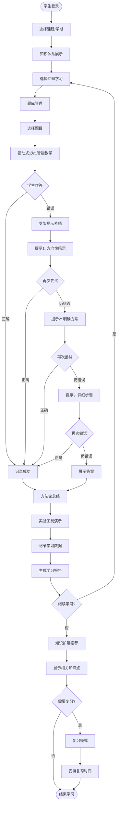

---

## 📊 分层业务流程详解

### 1️⃣ 学习准备阶段

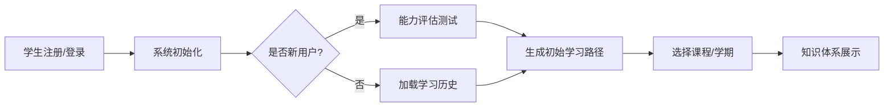

**涉及模块**:
- 知识体系展示 (模块1)
- 学习报告生成 (模块5)

---

### 2️⃣ 知识学习阶段

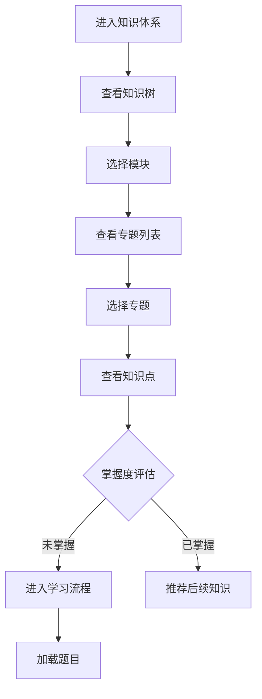

**涉及模块**:
- 知识体系展示 (模块1)
- 题库管理与结构化分解 (模块2)
- 知识扩展 (模块6)

---

### 3️⃣ 题目学习阶段（核心流程）

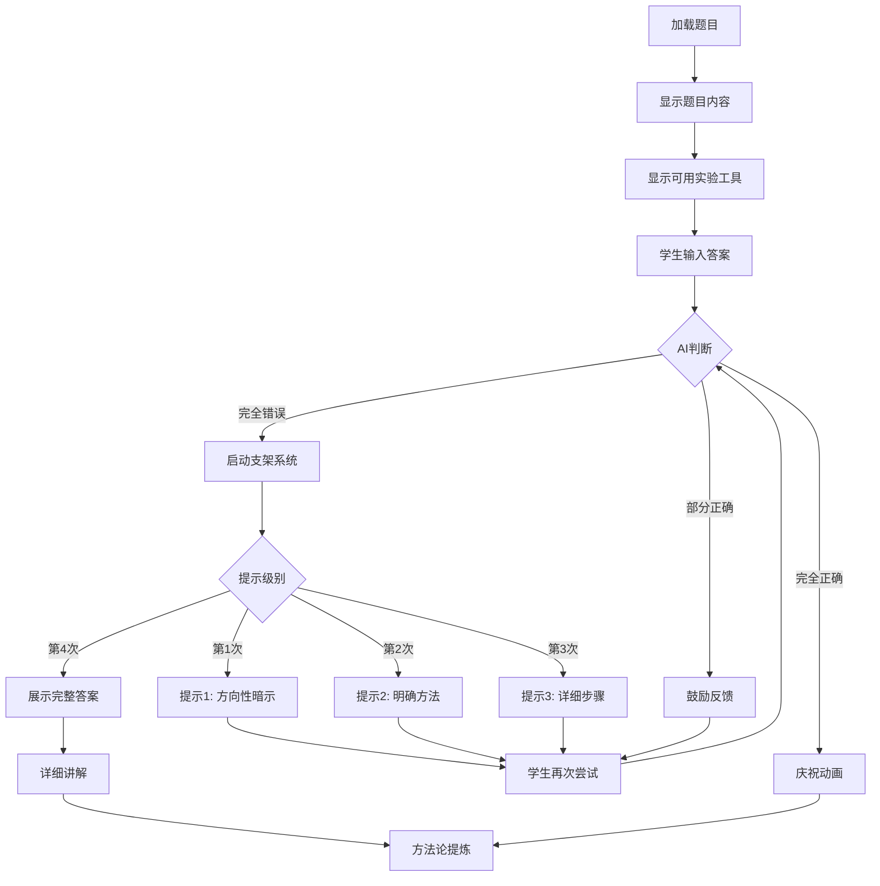

**涉及模块**:
- 题库管理与结构化分解 (模块2)
- 互动式1对1智能教学 (模块3)
- 动态实验工具系统 (模块4)

---

### 4️⃣ 实验工具演示阶段

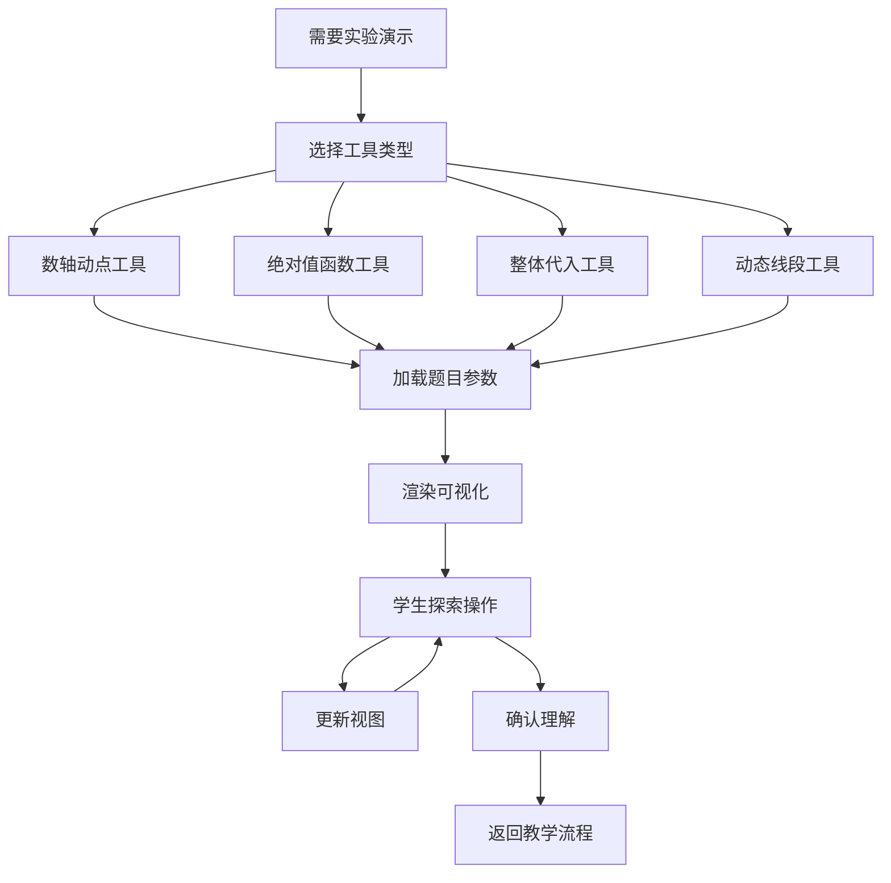

**涉及模块**:
- 动态实验工具系统 (模块4)
- 互动式1对1智能教学 (模块3)

---

### 5️⃣ 方法论总结阶段

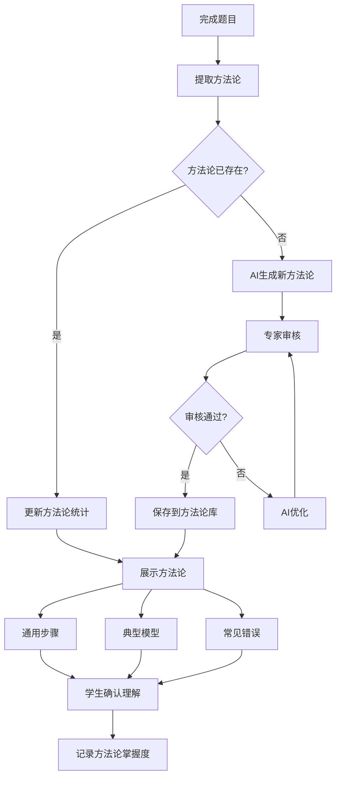

**涉及模块**:
- 互动式1对1智能教学 (模块3)
- 题库管理与结构化分解 (模块2)

---

### 6️⃣ 学习报告生成阶段

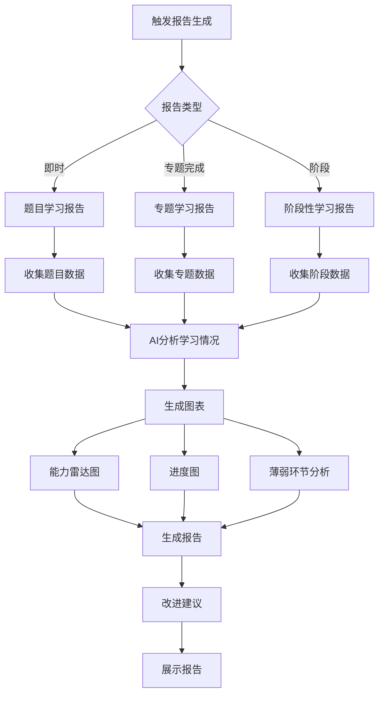

**涉及模块**:
- 学习报告生成 (模块5)
- 知识体系展示 (模块1) - 用于展示进度

---

### 7️⃣ 知识扩展阶段

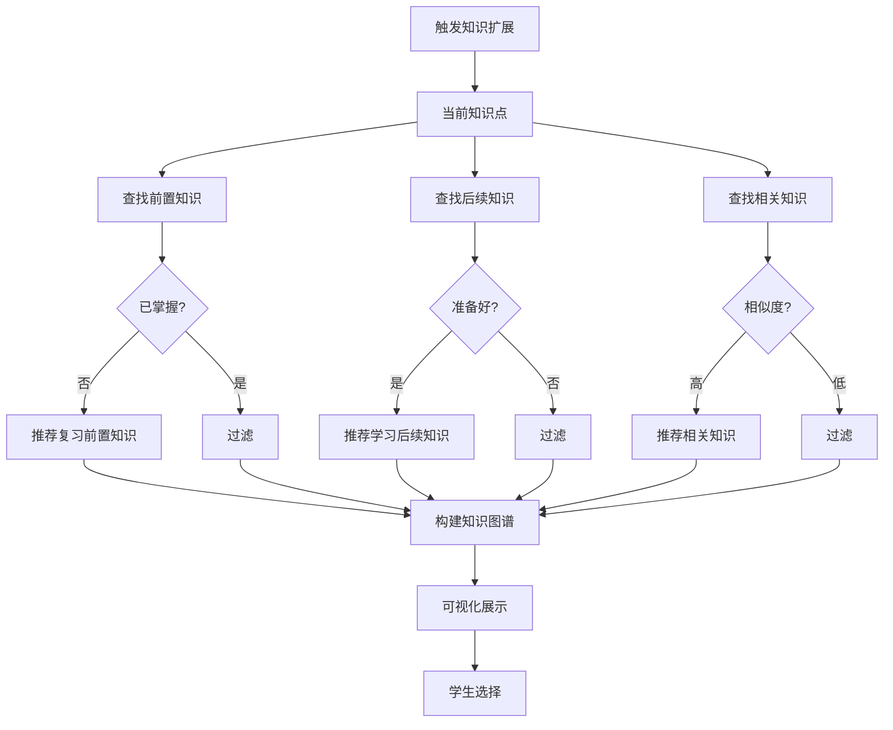

**涉及模块**:
- 知识扩展 (模块6)
- 知识体系展示 (模块1)

---

### 8️⃣ 复习模式阶段

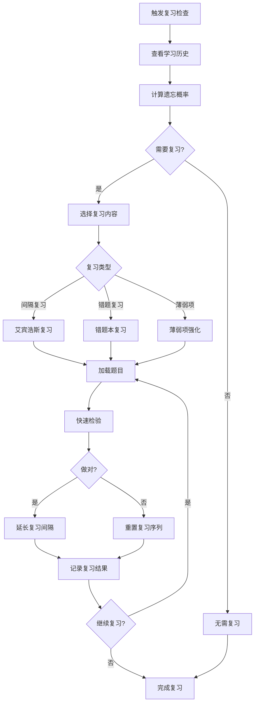

**涉及模块**:
- 复习模式 (模块7)
- 题库管理与结构化分解 (模块2)
- 学习报告生成 (模块5)

---

## 🔄 跨模块协同流程

### 场景1：首次学习新专题

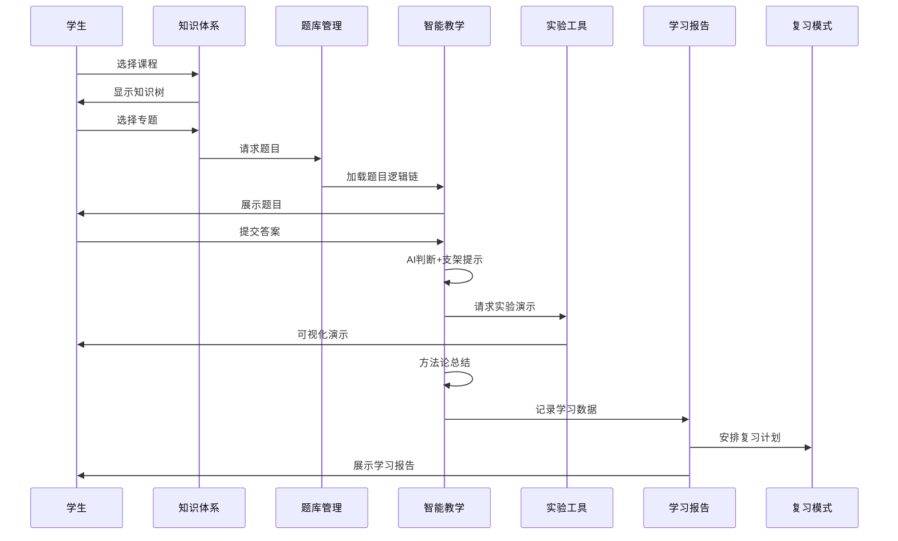

---

### 场景2：复习模式触发

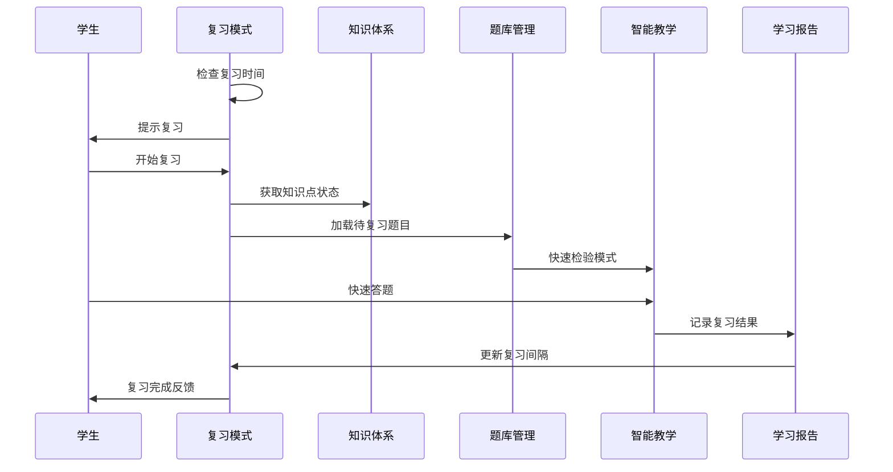

---

### 场景3：知识扩展推荐

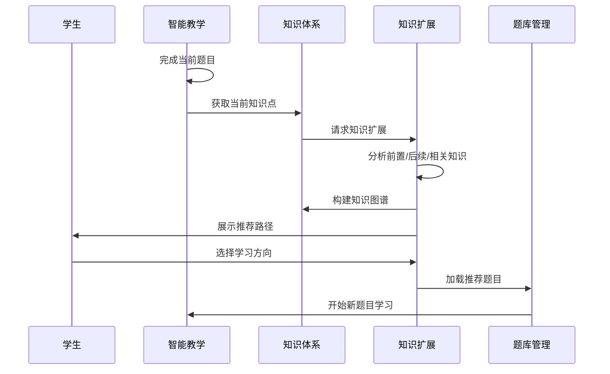

---

## 📈 数据流转关系

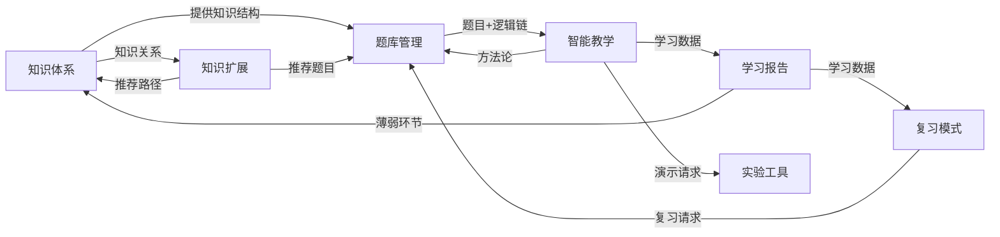

---

## 🎯 完整学习循环

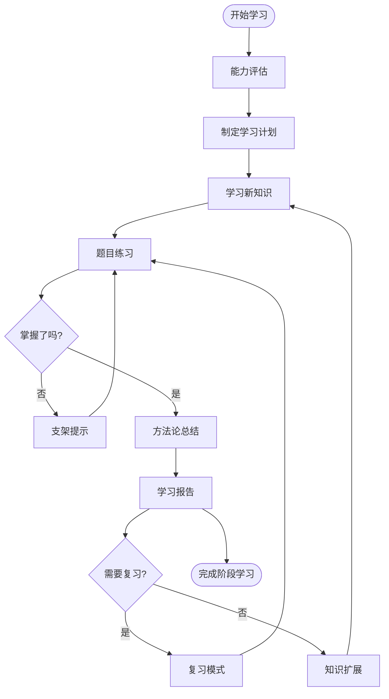

---

## 📝 流程图说明

### 图例含义

- **圆角矩形**: 表示开始/结束节点
- **矩形**: 表示处理步骤
- **菱形**: 表示判断节点
- **平行四边形**: 表示输入/输出
- **圆柱形**: 表示数据存储
- **箭头**: 表示数据流向或控制流

### 颜色标识（在支持的工具中）

- 🟢 **绿色**: 学生操作
- 🔵 **蓝色**: 系统处理
- 🟡 **黄色**: AI判断
- 🔴 **红色**: 支架提示/错误处理

---

## 🔗 相关文档

- [需求清单](./REQUIREMENTS.md) - 完整功能需求
- [功能详细需求](./requirements/) - 7个核心功能的详细说明
- [技术架构设计](./architecture/README.md) - 系统技术实现
