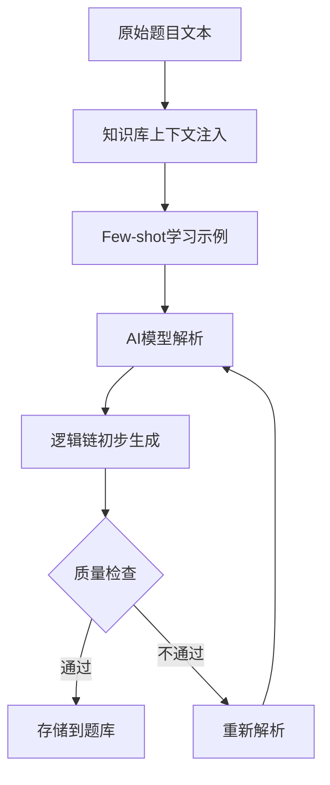

# 2. 题库管理与结构化分解

## 功能定位
构建智能化的题库管理系统，核心在于**AI驱动的题目结构化分解**，将复杂题目拆解为可教学的逻辑链。

## 2.1 题目采集与分类

### 题目来源
- 人工采集与标注：收集高质量初中数学真题及参考答案
- 支持批量导入：从Excel、JSON等格式导入题库
- 题目类型：选择题、填空题、计算题、应用题、证明题等

### 题目属性
- `problem_id`: 题目唯一标识（格式：P_MATH_年份_序号，如 P_MATH_2024_025）
- `linked_kp`: 关联的知识点ID列表（可关联多个知识点）
- `difficulty`: 难度等级（1-5星）
- `question_type`: 题目类型（选择/填空/计算/应用/证明）
- `source`: 题目来源（教材/考试/竞赛/原创）
- `tags`: 标签（如"动点问题"、"分类讨论"等）

## 2.2 结构化逻辑链分解

### 核心理念
将复杂题目拆解为循序渐进的解题步骤，每个步骤对应具体知识点，提供支架式教学提示。

### 逻辑链数据结构

```json
{
  "problem_id": "P_MATH_2024_025",
  "linked_kp": ["KP01_1", "KP02_1", "KP02_2", "KP02_4", "KP08_2"],
  "content": "题目内容完整描述",
  "logic_chain": [
    {
      "step": 1,
      "title": "步骤标题（如：静态数值破解）",
      "target_kp": "KP01_1 (知识点名称)",
      "goal": "本步骤目标（如：求出 a=-5, b=8 及 AB=13）",
      "check_points": ["检查点1", "检查点2"],
      "scaffolding": [
        "提示问题1（引导性提问）",
        "提示问题2（渐进式提示）",
        "提示问题3（细节确认）"
      ]
    }
  ]
}
```

### 字段说明

| 字段 | 类型 | 必填 | 说明 |
|------|------|------|------|
| `step` | Integer | 是 | 步骤序号（从1开始） |
| `title` | String | 是 | 步骤标题（简短描述，如"静态数值破解"） |
| `target_kp` | String | 是 | 本步骤考查的知识点ID和名称 |
| `goal` | String | 是 | 本步骤要达成的目标（具体可测） |
| `check_points` | Array | 是 | 检查点列表（用于判断学生是否完成本步） |
| `scaffolding` | Array | 是 | 三级提示系统（引导性→渐进式→细节确认） |

### 支架式教学提示设计原则

1. **第一级提示（观察引导）**
   - 引导学生观察题目特征
   - 提示关键信息位置
   - 激发学生联想相关知识点

2. **第二级提示（方法提示）**
   - 提示解题思路方向
   - 提示使用什么方法或公式
   - 给出半成品的推导框架

3. **第三级提示（具体细节）**
   - 给出具体的计算或推理步骤
   - 帮助学生突破卡点
   - 确保学生能够完成本步骤

## 2.3 AI驱动的题目结构化解析 ⭐ 核心创新

### 设计理念
**不采用人工编辑**，完全由AI大模型自动生成题目逻辑链数据结构。

### AI解析流程



### 2.3.1 知识库上下文注入

**目的**：让AI理解当前题目属于哪个知识体系，准确关联知识点。

**实现方法**：
- 根据题目所属专题，从知识库中提取相关知识点定义
- 将知识点详细说明作为系统提示的一部分注入
- 示例：

```
【知识库上下文】
当前题目属于：专题2-数轴动点问题
相关知识点：
- KP02_1 路程与坐标互化：P点坐标 xt = 起点 ± 速度 * t
- KP02_2 追及与相遇：利用相对速度或距离差建立等量关系列方程
- KP02_3 中点公式：若 M 是 AB 中点，则 xM = (xA + xB) / 2
- KP02_4 分类讨论：判断动点在定点的左侧还是右侧、相遇前还是相遇后
```

### 2.3.2 Few-shot学习示例

**目的**：通过高质量示例让AI学习正确的分解格式和思路。

**示例设计**：

**Input**：
```
题目：数轴上点A表示的数是-3，点B表示的数是6，点P从点A出发，以每秒2个单位长度的速度沿数轴向右运动，点Q从点B出发，以每秒1个单位长度的速度沿数轴向左运动。若P、Q同时出发，设运动时间为t秒。
(1) 当t=2时，求P、Q两点表示的数；
(2) 当t为何值时，P、Q两点重合？
```

**Output**（标准逻辑链）：
```json
{
  "logic_chain": [
    {
      "step": 1,
      "title": "静态数值破解",
      "target_kp": "KP02_1 (路程与坐标互化)",
      "goal": "求出 a=-5, b=8 及 AB=13",
      "check_points": ["正确求出A、B坐标", "正确计算AB长度"],
      "scaffolding": [
        "题目中给出的A、B坐标分别是什么？",
        "根据路程公式：坐标 = 起点 ± 速度 × 时间，你能表示出P、Q的坐标吗？",
        "P的坐标：-3 + 2t，Q的坐标：6 - t"
      ]
    },
    {
      "step": 2,
      "title": "追及相遇建模",
      "target_kp": "KP02_2 (追及与相遇)",
      "goal": "建立方程 -3 + 2t = 6 - t",
      "check_points": ["理解追及相遇的含义", "列出正确方程"],
      "scaffolding": [
        "两数轴上的点重合，意味着它们的坐标有什么关系？",
        "令P、Q坐标相等，你能列出方程吗？",
        "-3 + 2t = 6 - t"
      ]
    }
  ]
}
```

### 2.3.3 动态过滤与纠错

**质量检查维度**：

1. **完整性检查**
   - 是否覆盖所有关键解题步骤？
   - 每个步骤的目标是否明确可测？
   - 检查点是否具体可操作？

2. **支架性检查**
   - 三级提示是否递进？
   - 提示是否过于直接（相当于告诉答案）？
   - 提示是否过于模糊（无法帮助学生学习）？

3. **知识点关联检查**
   - 每个步骤是否准确对应知识点？
   - 是否遗漏关键知识点？
   - 是否错误关联不相关知识点？

**自动纠错机制**：
- 不通过质量检查的题目标记为"待人工审核"
- 重新解析时注入错误信息，避免重复错误
- 记录常见错误模式，优化系统提示词

### 2.3.4 AI提示词模板

**系统提示词**：

```
你是一位专业的初中数学教育专家，擅长将复杂题目拆解为循序渐进的教学步骤。

【任务】
分析给定的数学题目，生成结构化逻辑链数据。

【输出格式要求】
严格按照JSON格式输出，包含以下字段：
- step: 步骤序号
- title: 步骤标题（简短明确）
- target_kp: 目标知识点（从提供的知识点列表中选择）
- goal: 本步骤要达成的目标（具体可测）
- check_points: 检查点列表（判断学生是否完成本步）
- scaffolding: 三级提示数组（引导性→渐进式→具体细节）

【拆解原则】
1. 每个步骤对应一个明确的解题动作
2. 步骤之间要循序渐进，环环相扣
3. 三级提示要递进式提供帮助，而非直接给出答案
4. 检查点要具体可操作，便于判断学生掌握情况

【知识点库】
{知识点库上下文}

【参考示例】
{Few-shot示例}

【当前题目】
{题目内容}

请输出逻辑链JSON数据：
```

## 2.4 题目检索与筛选

### 检索维度
- 按知识点筛选
- 按难度等级筛选
- 按题目类型筛选
- 按来源筛选
- 按标签筛选
- 组合筛选（支持多维度AND/OR逻辑）

### 搜索功能
- 题目内容全文搜索
- 知识点名称搜索
- 标签搜索
- 支持模糊搜索和正则表达式

## 2.5 题目质量评估

### 评估维度
- **科学性**：题目内容准确无误
- **典型性**：能够代表该知识点的典型考查方式
- **梯度性**：与逻辑链步骤的匹配度
- **支架性**：提示的质量和有效性
- **完整性**：逻辑链是否覆盖完整解题路径

### 质量等级
- A级：优秀，可直接用于教学
- B级：良好，需微调后使用
- C级：一般，需人工审核修改
- D级：不合格，需重新解析

## 2.6 题目版本管理

### 版本控制
- 记录每次AI解析的版本
- 支持版本回退
- 支持人工修正后生成新版本
- 标记当前使用的版本

### 修正历史
- 记录修正时间和修正人
- 记录修正原因和修正内容
- 支持查看修正前后对比

## 2.7 数据统计与分析

### 题库统计
- 各知识点关联的题目数量
- 各难度等级的题目分布
- 各题目类型的题目分布
- 题目来源统计

### 质量分析
- AI解析成功率
- 各质量等级的题目占比
- 常见错误类型统计
- 人工修正频率统计

## 2.8 界面原型

### 题目列表页

```
┌────────────────────────────────────────────────────────┐
│  题库管理 > 专题2: 数轴动点问题                          │
├────────────────────────────────────────────────────────┤
│  筛选: [知识点▼] [难度▼] [类型▼]  [搜索]               │
│  共 25 道题目                                            │
├────────────────────────────────────────────────────────┤
│  ┌──────────────────────────────────────────────────┐ │
│  │ P_MATH_2024_025                   难度: ★★★☆☆  │ │
│  │ 标签: #动点问题 #追及相遇 #分类讨论               │ │
│  │ 知识点: KP02_1, KP02_2, KP02_4                   │ │
│  │ 质量等级: A  解析版本: v2.1                       │ │
│  │                                                    │ │
│  │ 题目：数轴上点A表示的数是-3，点B表示的数是6...     │ │
│  └──────────────────────────────────────────────────┘ │
│  ┌──────────────────────────────────────────────────┐ │
│  │ P_MATH_2024_026                   难度: ★★★★☆  │ │
│  │ ...                                               │ │
│  └──────────────────────────────────────────────────┘ │
└────────────────────────────────────────────────────────┘
```

### 逻辑链详情页

```
┌────────────────────────────────────────────────────────┐
│  题目逻辑链: P_MATH_2024_025                           │
├────────────────────────────────────────────────────────┤
│  题目: 数轴上点A表示的数是-3...                        │
│  知识点: KP02_1, KP02_2, KP02_4                        │
├────────────────────────────────────────────────────────┤
│  步骤 1: 静态数值破解                                   │
│  ─────────────────────────────────────────────────────  │
│  目标知识点: KP02_1 (路程与坐标互化)                    │
│  步骤目标: 求出 a=-5, b=8 及 AB=13                     │
│                                                         │
│  检查点:                                                │
│  ✓ 正确求出A、B坐标                                    │
│  ✓ 正确计算AB长度                                      │
│                                                         │
│  三级提示:                                              │
│  Level 1: 题目中给出的A、B坐标分别是什么？              │
│  Level 2: 根据路程公式，你能表示出P、Q的坐标吗？        │
│  Level 3: P的坐标：-3 + 2t，Q的坐标：6 - t             │
├────────────────────────────────────────────────────────┤
│  步骤 2: 追及相遇建模                                   │
│  ─────────────────────────────────────────────────────  │
│  ...                                                    │
└────────────────────────────────────────────────────────┘
```

## 2.9 技术实现要点

- 使用大语言模型API（如OpenAI GPT-4、Claude等）进行AI解析
- 提示词工程：精心设计系统提示词和Few-shot示例
- JSON Schema验证：确保AI输出格式正确
- 异步任务队列：批量解析任务后台处理
- 缓存机制：缓存已解析的题目逻辑链
