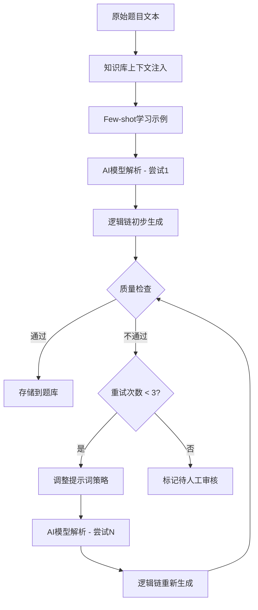

# 2. 题库管理与结构化分解

## 功能定位
构建智能化的题库管理系统，核心在于**AI驱动的题目结构化分解**，将复杂题目拆解为可教学的逻辑链。

## 2.1 题目采集与分类

### 采集策略概览

本系统采用**三轨并行**的题目采集策略：

| 采集渠道 | 优先级 | 主要用途 | 数据质量 | 人工介入 |
|---------|-------|---------|---------|---------|
| **OCR图像识别** | ⭐⭐⭐ | 试卷、教材数字化 | 高 | 10-30%需校对 |
| **AI生成相似题** | ⭐⭐ | 快速扩充题库，举一反三 | 中高 | 10%抽检 |
| **在线题库爬虫** | ⭐ | 补充题源 | 中 | 需严格清洗 |

---

### 2.1.1 OCR图像识别

#### 业务需求
能够将纸质试卷、练习册、教材中的数学题目快速数字化，自动识别题目文本和数学符号，转换为可编辑的文本格式。

#### 核心功能
1. **图片上传与识别**
   - 支持JPG、PNG等常见图片格式
   - 单次上传或批量上传
   - 实时显示识别进度

2. **识别质量评估**
   - 自动计算识别置信度（0-100%）
   - 根据置信度自动分类处理：
     - **高置信度（≥90%）**：自动通过，进入AI解析
     - **中置信度（70-89%）**：标记需人工确认
     - **低置信度（<70%）**：标记需重新录入

3. **识别结果管理**
   - 查看识别历史记录
   - 编辑和修正识别内容
   - 删除错误的识别记录
   - 重新识别失败的图片

#### 业务规则
- 每张图片仅识别一道题目（多题目需拆分上传）
- 识别结果自动保存，支持追溯
- 保留原始图片供人工校对参考
- 支持数学公式和符号识别（如：√、²、±、°等）

#### 质量标准
| 置信度 | 准确率要求 | 处理方式 |
|--------|-----------|---------|
| ≥90% | ≥95% | 自动通过 |
| 70-89% | ≥85% | 人工校对 |
| <70% | <85% | 重新录入 |

---

### 2.1.2 AI生成相似题

#### 业务需求
基于现有高质量题目，自动生成"相似但不同"的变体题目，实现快速扩充题库，满足"举一反三"的教学需求。

#### 核心功能
1. **案例题目选择**
   - 从题库中选择高质量题目作为案例
   - 支持按知识点、难度筛选
   - 查看案例题目的详细信息和逻辑链

2. **生成参数配置**
   - **变体策略**：综合变体（数值+场景+难度）
   - **生成数量**：1-5题
   - **目标难度**：保持、提升、降低
   - **目标知识点**：必须考查的知识点

3. **质量自动检查**
   - **知识点验证**：确保考查目标知识点
   - **数学合理性**：验证数据在数学上成立
   - **可解题性**：通过AI求解验证可解

4. **生成结果管理**
   - 查看生成的题目和变体说明
   - 对比原题与生成题的差异
   - 编辑和调整生成内容
   - 批量入库或拒绝

#### 业务规则
- 每道案例题目最多生成5道变体
- AI生成失败自动重试，最多3次
- 质量评分B级以上自动入库
- 质量评分C级及以下标记需人工审核
- 标注为"AI生成"并记录参考题目ID

#### 应用场景
- **知识点题量不足**：为特定知识点快速扩充题目
- **难度梯度缺失**：生成更简单或更复杂的版本
- **个性化练习**：为学生生成专属练习题（避免重复）
- **变式训练**：提供同一知识点的不同考查形式

#### 质量标准
- **知识点关联度**：100%（必须考查指定知识点）
- **数学合理性**：100%（无数学矛盾）
- **可解题性**：100%（有明确解法）
- **人工抽检通过率**：≥90%（10%随机抽检）

---

### 2.1.3 AI驱动的智能爬虫系统 ⭐ 核心创新

#### 业务需求
基于知识点自动从互联网搜索和采集相关题目，实现**零人工干预**的智能题库扩充。系统通过大模型理解知识点语义，自动搜索、识别、解析、清洗并入库相关题目。

#### 设计理念

**传统爬虫的痛点**：
- 需要手动指定目标网站和爬取规则
- 不同网站结构不同，规则难以复用
- 爬取质量不稳定，需要大量人工筛选

**AI驱动的智能爬虫**：
- 选择知识点后，AI自动生成搜索策略
- 通过大模型理解题目内容，自动筛选高质量题目
- 智能去重和质量评分，全自动入库流程

#### 核心功能

##### 1. 基于知识点的智能搜索

**输入**：用户选择一个知识点（例如：KP02_1 数轴动点问题）

**AI自动执行**：
1. **语义理解**：分析知识点的关键词和考查范围
   - 提取核心概念：数轴、动点、运动、坐标、速度
   - 识别关联知识点：追及相遇、中点公式、距离计算

2. **生成搜索查询**：
   - 主查询："数轴动点问题 初中数学"
   - 变体查询："数轴上点的运动 题目"、"动点追及相遇问题"
   - 深度查询："数轴动点 压轴题 中考"

3. **多渠道并行搜索**：
   - 搜索引擎：百度、谷歌、必应
   - 教育网站：学科网、菁优网、21世纪教育网
   - 题库平台：作业帮、猿题库、小猿搜题
   - 开放资源：各省市中考真题库

##### 2. AI智能题目提取与解析

**从搜索结果中提取题目**：

1. **网页内容分析**：
   - 访问搜索结果的前50个网页
   - AI识别网页中的题目区域（排除导航、广告等无关内容）
   - 提取题目文本、选项、答案、解析

2. **数学符号识别**：
   - 识别LaTeX公式：`$y = ax^2 + bx + c$`
   - 识别图片中的数学符号（OCR）
   - 统一符号格式（如：² → ^2, √ → sqrt）

3. **结构化解析**：
   - 自动识别题目类型（选择题、填空题、计算题等）
   - 提取已知条件和求解目标
   - 识别图形描述（几何题）

##### 3. 智能质量评估系统

**AI自动评分维度**：

| 评估维度 | 权重 | 判断标准 |
|---------|------|---------|
| **知识点相关度** | 40% | AI判断题目是否考查目标知识点（≥90%相关） |
| **题目完整性** | 25% | 包含完整的题目陈述、条件、求解目标 |
| **数学合理性** | 20% | 数据无矛盾，逻辑正确，可求解 |
| **表述清晰度** | 10% | 语言准确，无歧义，符合教学规范 |
| **难度适宜度** | 5% | 难度与知识点等级匹配（初中/高中） |

**质量等级判定**：
- **A级（90-100分）**：自动入库，无需审核
- **B级（80-89分）**：自动入库，标记"建议复核"
- **C级（70-79分）**：进入待审核队列
- **D级（<70分）**：自动丢弃

##### 4. 智能去重系统

**三层去重机制**：

1. **语义相似度去重**：
   - 使用AI嵌入模型计算题目语义相似度
   - 相似度 ≥ 85% 视为重复
   - 保留质量评分更高的版本

2. **知识点特征去重**：
   - 比较题目考查的知识点组合
   - 相同知识点组合 + 相似数值范围 → 判定为重复
   - 保留难度梯度更好的版本

3. **数据指纹去重**：
   - 对题目内容生成MD5哈希
   - 完全相同的题目直接去重
   - 记录去重日志用于统计分析

##### 5. 自动标注与分类

**AI自动生成元数据**：

- **题目来源**：自动记录来源网站和URL
- **知识点标签**：AI分析并关联相关知识点
- **难度等级**：根据题目复杂度自动评定1-5星
- **适用学段**：判断为初中/高中/小学
- **题型标签**：自动添加标签（如：#动点问题 #分类讨论）
- **质量评分**：根据评估系统打分并定级

##### 6. 全自动入库流程

```
┌─────────────────────────────────────────────────────────────┐
│  用户选择知识点：KP02_1 数轴动点问题                          │
└────────────────────┬────────────────────────────────────────┘
                     │
                     ▼
┌─────────────────────────────────────────────────────────────┐
│  AI生成搜索策略                                              │
│  - 主查询："数轴动点问题 初中数学"                           │
│  - 变体查询："动点追及相遇" "数轴运动"                        │
│  - 搜索引擎：百度、谷歌、必应                                 │
└────────────────────┬────────────────────────────────────────┘
                     │
                     ▼
┌─────────────────────────────────────────────────────────────┐
│  并行搜索与网页抓取                                          │
│  - 访问前50个搜索结果                                        │
│  - 提取页面内容                                              │
│  - 遵守robots.txt，控制访问频率                              │
└────────────────────┬────────────────────────────────────────┘
                     │
                     ▼
┌─────────────────────────────────────────────────────────────┐
│  AI智能提取与解析                                            │
│  - 识别题目区域                                              │
│  - 提取题目文本、答案、解析                                  │
│  - 识别数学符号和公式                                        │
│  - 结构化数据（JSON格式）                                    │
└────────────────────┬────────────────────────────────────────┘
                     │
                     ▼
┌─────────────────────────────────────────────────────────────┐
│  智能质量评估                                                │
│  - 知识点相关度评分                                         │
│  - 完整性、合理性评分                                        │
│  - 判定质量等级（A/B/C/D）                                   │
└────────────────────┬────────────────────────────────────────┘
                     │
                     ▼
┌─────────────────────────────────────────────────────────────┐
│  智能去重                                                    │
│  - 语义相似度计算                                            │
│  - 知识点特征比对                                            │
│  - 过滤重复题目                                              │
└────────────────────┬────────────────────────────────────────┘
                     │
                     ▼
┌─────────────────────────────────────────────────────────────┐
│  分类与标注                                                  │
│  - 关联知识点标签                                            │
│  - 评定难度等级                                              │
│  - 生成题型标签                                              │
│  - 记录来源信息                                              │
└────────────────────┬────────────────────────────────────────┘
                     │
                     ▼
┌─────────────────────────────────────────────────────────────┐
│  自动入库                                                    │
│  - A级题目：直接入库                                         │
│  - B级题目：入库，标记"建议复核"                             │
│  - C级题目：进入待审核队列                                   │
│  - D级题目：丢弃                                             │
└─────────────────────────────────────────────────────────────┘
```

#### 业务规则

**自动化原则**：
- ✅ 用户只需选择知识点，系统全自动执行
- ✅ A级题目自动入库，无需人工干预
- ✅ B级题目自动入库但标记需复核
- ⚠️ C级题目进入待审核队列（预计<10%）
- ❌ D级题目自动丢弃

**采集限制**：
- 单个知识点最多采集100道题目（控制成本）
- 每个知识点每天只能触发1次采集（避免重复）
- 总采集题目数受预算控制（可设置月度上限）

**合规性保障**：
- 自动标注题目来源（网站名称+URL）
- 仅采集公开可访问的教育资源
- 尊重版权，仅供教育研究使用
- 不爬取需要付费或登录的内容

#### 质量标准

| 指标 | 目标值 | 说明 |
|-----|-------|------|
| **知识点相关准确率** | ≥95% | AI判断相关度与人工复核的一致性 |
| **格式正确率** | ≥90% | 数学符号、结构化格式的准确性 |
| **去重准确率** | ≥95% | 语义去重与人工判断的一致性 |
| **A级题目占比** | ≥60% | 高质量题目占比目标 |
| **自动入库率** | ≥85% | A+B级题目自动入库比例 |
| **人工审核比例** | ≤15% | 仅C级题目需要人工审核 |

#### 用户体验设计

**操作流程（超简单）**：

1. 用户在知识体系中选择一个知识点
2. 点击"智能采集相关题目"按钮
3. 系统显示进度：
   - ✅ 正在搜索相关资源...
   - ✅ 已分析50个网页，发现120道题目...
   - ✅ 质量评估中...
   - ✅ 去重处理中...
   - ✅ 成功入库85道题目（A级60道，B级25道）
4. 点击查看入库的题目列表

**可选高级设置**：
- 采集数量限制（默认100道，可调整）
- 难度范围筛选（默认不限，可选"只采集中等难度"）
- 排除已入库题目（默认开启）
- 预算控制（设置单次最大成本）

#### 技术实现要点

**AI模型使用**：

1. **搜索查询生成**：使用LLM（如GPT-4）生成多样化搜索词
2. **网页内容解析**：使用专用的内容提取AI（如BeautifulSoup + AI判断）
3. **质量评估**：使用专门训练的评分模型
4. **去重计算**：使用向量嵌入模型（如text-embedding-ada-002）
5. **数学符号识别**：LaTeX Parser + OCR模型

**网络搜索实现（通过 MCP 服务）**：

系统使用 Model Context Protocol (MCP) 的网络搜索服务来实现智能网络搜索功能，具体架构如下：

1. **MCP 网络搜索服务集成**：
   ```typescript
   // MCP 服务调用示例
   interface MCPSearchRequest {
     query: string           // 搜索查询词
     numResults?: number     // 返回结果数量（默认50）
     searchEngine?: string   // 搜索引擎选择（baidu/google/bing）
   }

   interface MCPSearchResult {
     url: string             // 网页URL
     title: string           // 网页标题
     snippet: string         // 内容摘要
     relevanceScore: number  // 相关度评分
   }
   ```

2. **并行搜索策略**：
   - 通过 MCP 服务同时调用多个搜索引擎 API
   - 异步并发请求，提高搜索效率
   - 自动合并和去重搜索结果

3. **智能搜索查询生成流程**：
   ```
   用户选择知识点
       ↓
   LLM 分析知识点语义
       ↓
   生成多个搜索查询（主查询 + 变体查询）
       ↓
   通过 MCP 网络搜索服务并发调用各搜索引擎
       ↓
   返回结构化的搜索结果列表
       ↓
   AI 评估每个结果的相关度和质量
       ↓
   选择 Top 50 网页进行内容提取
   ```

4. **MCP 服务配置**：
   - **服务端点**：配置 MCP 网络搜索服务的 API 地址
   - **认证方式**：使用 API Key 或 OAuth 进行身份验证
   - **限流控制**：遵守各搜索引擎的 API 调用限制
   - **错误重试**：自动重试失败的请求（最多3次）

5. **搜索结果优化**：
   - 去除搜索结果中的广告和无关内容
   - 优先选择教育类网站和权威题库
   - 过滤掉低质量和垃圾网站
   - 记录搜索历史，避免重复查询

6. **内容抓取实现**：
   ```typescript
   // 基于搜索结果的网页抓取
   async function fetchWebContent(searchResults: MCPSearchResult[]) {
     const contents = await Promise.all(
       searchResults.map(async (result) => {
         // 遵守 robots.txt
         if (!await canFetch(result.url)) return null

         // 控制访问频率
         await rateLimitDelay()

         // 抓取网页内容
         const response = await fetch(result.url)
         const html = await response.text()

         // AI 提取题目内容
         return extractQuestionsFromHTML(html)
       })
     )
     return contents.filter(Boolean)
   }
   ```

**成本控制**：

- 使用免费API优先（如搜索引擎API）
- AI调用次数优化（批量处理，缓存结果）
- 设置每日/每月预算上限
- MCP 服务调用缓存：相同查询24小时内不重复调用

---

### 题目类型

支持以下题型：
- **选择题**：单选题、多选题
- **填空题**：数值填空、表达式填空
- **计算题**：代数计算、几何计算
- **应用题**：文字应用题、建模题
- **证明题**：几何证明、代数证明

---

### 题目属性

每道题目包含以下属性：

| 属性名 | 说明 | 示例 |
|-------|------|------|
| `problem_id` | 题目唯一标识 | P_MATH_2024_025 |
| `content` | 题目内容 | 完整的题目描述 |
| `linked_kp` | 关联的知识点ID列表 | ["KP02_1", "KP02_2"] |
| `difficulty` | 难度等级（1-5星） | 3 |
| `question_type` | 题目类型 | 计算题 |
| `source` | 题目来源 | OCR识别 / AI生成 / 在线爬取 / 人工录入 |
| `source_detail` | 来源详情 | 2024年某市中考第15题 |
| `tags` | 标签 | #动点问题 #追及相遇 #分类讨论 |
| `quality_score` | 质量等级（A/B/C/D） | A |
| `status` | 题目状态 | 待审核 / 已入库 / 已归档 |

## 2.2 结构化逻辑链分解

### 核心理念
将复杂题目拆解为循序渐进的解题步骤，每个步骤对应具体知识点，提供支架式教学提示。

### 逻辑链数据结构

```json
{
  "problem_id": "P_MATH_2024_025",
  "linked_kp": ["KP01_1", "KP02_1", "KP02_2", "KP02_4", "KP08_2"],
  "content": "题目内容完整描述",
  "logic_chain": [
    {
      "step": 1,
      "title": "步骤标题（如：静态数值破解）",
      "target_kp": "KP01_1 (知识点名称)",
      "goal": "本步骤目标（如：求出 a=-5, b=8 及 AB=13）",
      "check_points": ["检查点1", "检查点2"],
      "scaffolding": [
        "提示问题1（引导性提问）",
        "提示问题2（渐进式提示）",
        "提示问题3（细节确认）"
      ]
    }
  ]
}
```

### 字段说明

| 字段 | 类型 | 必填 | 说明 |
|------|------|------|------|
| `step` | Integer | 是 | 步骤序号（从1开始） |
| `title` | String | 是 | 步骤标题（简短描述，如"静态数值破解"） |
| `target_kp` | String | 是 | 本步骤考查的知识点ID和名称 |
| `goal` | String | 是 | 本步骤要达成的目标（具体可测） |
| `check_points` | Array | 是 | 检查点列表（用于判断学生是否完成本步） |
| `scaffolding` | Array | 是 | 三级提示系统（引导性→渐进式→细节确认） |

### 支架式教学提示设计原则

1. **第一级提示（观察引导）**
   - 引导学生观察题目特征
   - 提示关键信息位置
   - 激发学生联想相关知识点

2. **第二级提示（方法提示）**
   - 提示解题思路方向
   - 提示使用什么方法或公式
   - 给出半成品的推导框架

3. **第三级提示（具体细节）**
   - 给出具体的计算或推理步骤
   - 帮助学生突破卡点
   - 确保学生能够完成本步骤

## 2.3 AI驱动的题目结构化解析 ⭐ 核心创新

### 设计理念

**不采用人工编辑**，完全由AI大模型自动生成题目逻辑链数据结构。

### AI解析流程



### AI解析重试机制

#### 业务需求

AI自动解析题目时，不可避免会出现解析失败或质量不达标的情况。需要设计智能的重试机制，在控制成本的同时提高解析成功率。

#### 重试触发条件

当AI解析结果出现以下任一情况时，触发重试：

1. **格式错误**
   - 输出无法解析为有效的JSON格式
   - 缺少必需字段（step、title、target_kp、goal、scaffolding等）
   - 字段类型不匹配（如step不是数字）

2. **质量不达标**
   - 完整性检查失败：步骤数量明显不足（如复杂题目只有1-2步）
   - 支架性检查失败：三级提示递进性不足或过于直接
   - 知识点关联失败：关联的知识点不在指定范围内

3. **数学不合理**
   - 步骤之间逻辑矛盾
   - 目标不可达成
   - 检查点无法验证

#### 重试策略

**重试次数限制**：最多重试3次（含首次解析，共4次机会）

**逐次调整策略**：

| 尝试次数 | 提示词调整 | 质量阈值 | 说明 |
|---------|-----------|---------|------|
| 第1次 | 标准提示词 | 正常标准 | 常规解析 |
| 第2次 | 加强格式要求 | 正常标准 | 强调JSON格式和字段完整性 |
| 第3次 | 注入错误信息 | 降低10% | 告知AI之前的错误，避免重复 |
| 第4次 | 极简化模式 | 降低20% | 仅要求生成核心步骤，降低复杂度 |

**提示词调整示例**：

- 第2次提示词增加：
  ```
  【重要】输出必须是严格的JSON格式，不要包含任何注释或额外文字。
  确保包含以下字段：step, title, target_kp, goal, check_points, scaffolding
  ```

- 第3次提示词增加：
  ```
  【之前的错误】上次解析失败的原因是：{具体错误}
  请避免类似问题，重新生成逻辑链。
  ```

- 第4次提示词调整：
  ```
  【简化模式】如果无法生成完整逻辑链，请至少生成2-3个核心步骤，
  确保每个步骤包含：步骤标题、目标、一级提示。
  ```

#### 失败处理

**3次重试后仍失败**：

- **自动标记**：将题目状态标记为"待人工审核"
- **失败原因记录**：保存每次失败的错误信息
- **部分结果保留**：如果某次解析结果部分可用，保留供人工参考
- **转人工审核**：加入人工审核队列

#### 业务规则

- 单道题目的AI解析成本上限：$0.50（约4次API调用）
- 每日批量解析任务限制：根据预算设定
- 重试次数计入统计：用于分析常见错误类型
- 成功率监控：目标解析成功率 ≥ 75%

#### 质量阈值调整

根据题目复杂度动态调整质量阈值：

| 难度等级 | 质量要求 | 说明 |
|---------|---------|------|
| 1-2星（简单） | 严格 | 必须生成完整的3-5步逻辑链 |
| 3星（中等） | 正常 | 标准质量检查 |
| 4-5星（复杂） | 宽松 | 允许步骤简化，重试时降低阈值 |

#### 统计与分析

系统自动记录以下统计数据，用于优化AI解析能力：

- **首次解析成功率**：第1次即通过的比例
- **重试后成功率**：重试后最终通过的比例
- **失败率**：重试3次仍失败的比例
- **失败原因分布**：格式错误、质量不达标、数学不合理等
- **不同题型的成功率**：选择题、填空题、计算题等的成功率对比

---

### 2.3.1 知识库上下文注入

**目的**：让AI理解当前题目属于哪个知识体系，准确关联知识点。

**实现方法**：
- 根据题目所属专题，从知识库中提取相关知识点定义
- 将知识点详细说明作为系统提示的一部分注入
- 示例：

```
【知识库上下文】
当前题目属于：专题2-数轴动点问题
相关知识点：
- KP02_1 路程与坐标互化：P点坐标 xt = 起点 ± 速度 * t
- KP02_2 追及与相遇：利用相对速度或距离差建立等量关系列方程
- KP02_3 中点公式：若 M 是 AB 中点，则 xM = (xA + xB) / 2
- KP02_4 分类讨论：判断动点在定点的左侧还是右侧、相遇前还是相遇后
```

### 2.3.2 Few-shot学习示例

**目的**：通过高质量示例让AI学习正确的分解格式和思路。

**示例设计**：

**Input**：
```
题目：数轴上点A表示的数是-3，点B表示的数是6，点P从点A出发，以每秒2个单位长度的速度沿数轴向右运动，点Q从点B出发，以每秒1个单位长度的速度沿数轴向左运动。若P、Q同时出发，设运动时间为t秒。
(1) 当t=2时，求P、Q两点表示的数；
(2) 当t为何值时，P、Q两点重合？
```

**Output**（标准逻辑链）：
```json
{
  "logic_chain": [
    {
      "step": 1,
      "title": "静态数值破解",
      "target_kp": "KP02_1 (路程与坐标互化)",
      "goal": "求出 a=-5, b=8 及 AB=13",
      "check_points": ["正确求出A、B坐标", "正确计算AB长度"],
      "scaffolding": [
        "题目中给出的A、B坐标分别是什么？",
        "根据路程公式：坐标 = 起点 ± 速度 × 时间，你能表示出P、Q的坐标吗？",
        "P的坐标：-3 + 2t，Q的坐标：6 - t"
      ]
    },
    {
      "step": 2,
      "title": "追及相遇建模",
      "target_kp": "KP02_2 (追及与相遇)",
      "goal": "建立方程 -3 + 2t = 6 - t",
      "check_points": ["理解追及相遇的含义", "列出正确方程"],
      "scaffolding": [
        "两数轴上的点重合，意味着它们的坐标有什么关系？",
        "令P、Q坐标相等，你能列出方程吗？",
        "-3 + 2t = 6 - t"
      ]
    }
  ]
}
```

### 2.3.3 动态过滤与纠错

**质量检查维度**：

1. **完整性检查**
   - 是否覆盖所有关键解题步骤？
   - 每个步骤的目标是否明确可测？
   - 检查点是否具体可操作？

2. **支架性检查**
   - 三级提示是否递进？
   - 提示是否过于直接（相当于告诉答案）？
   - 提示是否过于模糊（无法帮助学生学习）？

3. **知识点关联检查**
   - 每个步骤是否准确对应知识点？
   - 是否遗漏关键知识点？
   - 是否错误关联不相关知识点？

**自动纠错机制**：
- 不通过质量检查的题目标记为"待人工审核"
- 重新解析时注入错误信息，避免重复错误
- 记录常见错误模式，优化系统提示词

### 2.3.4 AI提示词模板

**系统提示词**：

```
你是一位专业的初中数学教育专家，擅长将复杂题目拆解为循序渐进的教学步骤。

【任务】
分析给定的数学题目，生成结构化逻辑链数据。

【输出格式要求】
严格按照JSON格式输出，包含以下字段：
- step: 步骤序号
- title: 步骤标题（简短明确）
- target_kp: 目标知识点（从提供的知识点列表中选择）
- goal: 本步骤要达成的目标（具体可测）
- check_points: 检查点列表（判断学生是否完成本步）
- scaffolding: 三级提示数组（引导性→渐进式→具体细节）

【拆解原则】
1. 每个步骤对应一个明确的解题动作
2. 步骤之间要循序渐进，环环相扣
3. 三级提示要递进式提供帮助，而非直接给出答案
4. 检查点要具体可操作，便于判断学生掌握情况

【知识点库】
{知识点库上下文}

【参考示例】
{Few-shot示例}

【当前题目】
{题目内容}

请输出逻辑链JSON数据：
```

## 2.4 题目检索与筛选

### 检索维度
- 按知识点筛选
- 按难度等级筛选
- 按题目类型筛选
- 按来源筛选
- 按标签筛选
- 组合筛选（支持多维度AND/OR逻辑）

### 搜索功能
- 题目内容全文搜索
- 知识点名称搜索
- 标签搜索
- 支持模糊搜索和正则表达式

## 2.5 题目质量评估

### 评估维度
- **科学性**：题目内容准确无误
- **典型性**：能够代表该知识点的典型考查方式
- **梯度性**：与逻辑链步骤的匹配度
- **支架性**：提示的质量和有效性
- **完整性**：逻辑链是否覆盖完整解题路径

### 质量等级
- A级：优秀，可直接用于教学
- B级：良好，需微调后使用
- C级：一般，需人工审核修改
- D级：不合格，需重新解析

## 2.6 数据统计与分析

### 题库统计
- 各知识点关联的题目数量
- 各难度等级的题目分布
- 各题目类型的题目分布
- 题目来源统计

### 质量分析
- AI解析成功率
- 各质量等级的题目占比
- 常见错误类型统计
- 人工修正频率统计

## 2.7 界面原型

### 题目列表页

```
┌────────────────────────────────────────────────────────┐
│  题库管理 > 专题2: 数轴动点问题                          │
├────────────────────────────────────────────────────────┤
│  筛选: [知识点▼] [难度▼] [类型▼]  [搜索]               │
│  共 25 道题目                                            │
├────────────────────────────────────────────────────────┤
│  ┌──────────────────────────────────────────────────┐ │
│  │ P_MATH_2024_025                   难度: ★★★☆☆  │ │
│  │ 标签: #动点问题 #追及相遇 #分类讨论               │ │
│  │ 知识点: KP02_1, KP02_2, KP02_4                   │ │
│  │ 质量等级: A  解析版本: v2.1                       │ │
│  │                                                    │ │
│  │ 题目：数轴上点A表示的数是-3，点B表示的数是6...     │ │
│  └──────────────────────────────────────────────────┘ │
│  ┌──────────────────────────────────────────────────┐ │
│  │ P_MATH_2024_026                   难度: ★★★★☆  │ │
│  │ ...                                               │ │
│  └──────────────────────────────────────────────────┘ │
└────────────────────────────────────────────────────────┘
```

### 逻辑链详情页

```
┌────────────────────────────────────────────────────────┐
│  题目逻辑链: P_MATH_2024_025                           │
├────────────────────────────────────────────────────────┤
│  题目: 数轴上点A表示的数是-3...                        │
│  知识点: KP02_1, KP02_2, KP02_4                        │
├────────────────────────────────────────────────────────┤
│  步骤 1: 静态数值破解                                   │
│  ─────────────────────────────────────────────────────  │
│  目标知识点: KP02_1 (路程与坐标互化)                    │
│  步骤目标: 求出 a=-5, b=8 及 AB=13                     │
│                                                         │
│  检查点:                                                │
│  ✓ 正确求出A、B坐标                                    │
│  ✓ 正确计算AB长度                                      │
│                                                         │
│  三级提示:                                              │
│  Level 1: 题目中给出的A、B坐标分别是什么？              │
│  Level 2: 根据路程公式，你能表示出P、Q的坐标吗？        │
│  Level 3: P的坐标：-3 + 2t，Q的坐标：6 - t             │
├────────────────────────────────────────────────────────┤
│  步骤 2: 追及相遇建模                                   │
│  ─────────────────────────────────────────────────────  │
│  ...                                                    │
└────────────────────────────────────────────────────────┘
```
